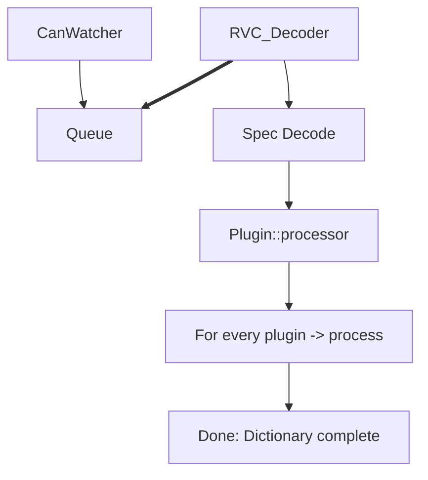

# Message Processing

This doc describes how incoming CANBUS RVC messages are processed

```mermaid
flowchart TB
    CanWatcher --> Queue
    RVC_Decoder ==> Queue 
    RVC_Decoder --> D[Spec Decode]
    D --> E[Plugin::processor]
    E --> F[For every plugin -> process]
    F --> G[Done: Dictionary complete]
    

```