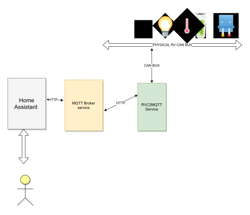
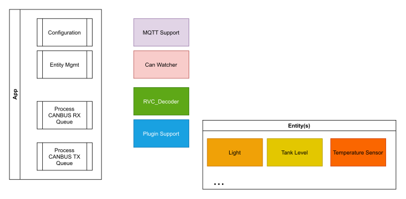

# RVC2MQTT Overview

This is a service (green box below) that runs on hardware that has access to the RV CANBus and a MQTT Broker.  The service enables bidirectional communication to the RV devices (sensors, switches, lights, HVAC, etc) from home assistant (or any other "smart home application")  

## Basic Requirements 

For software and hardware requirements see [hardware.md](hardware.md)

## Software Design

The overall project code (written in Python) has been separated into modules with the intent
to make it more manageable and maintainable.  

### App 

The overall application entrypoint that drives the initial setup and configuration as well as the main loop of checking queues for messages and processing.

Configuration - Parse cli parameters and use it to setup everything.  This includes MQTT client, CANBUS interface, RVC Decoder (using spec file), and user supplied plugins.  

Entity Mgmt - From the floor plan files parse out the `floorplan` which is a description of the sensors in the RV.  Then instantiate entities for each entry to deal with state changes and command requests. 

Process CANBUS Rx - The CAN watcher will listen to all messages on the RV CAN Bus and add them to the Rx Queue.  The App must:
    1. Take a message from queue and decode it to RVC
    2. Ask the instantiated entities to process the message.
       - If of interest the entity will do something with it (ie. Update state, etc)
       - Else - ignore it so other entities can process
    3. If no entity log the message.

Process CANBUS Tx - The entities may want to send a RVC message.  To do this they put a message into the Tx Queue and then the app must:
    1. Translate RVC DGN to CANBUS arbitration id
    2. Create python-can `message` object and queue it with CAN Watcher

Thats it for the app.  

### MQTT Support

See [mqtt.md](mqtt.md) for more details about MQTT mapping.
Overall, the process is using `paho-mqtt` Python Library to create a client.  The entities then publish information and subscribe to commands.

### CAN Watcher

This is a simple class using `python-can` to support bi-directional communication on the CANBUS.  This mostly runs its own thread and gets and puts messages into the correct queues (rx/tx)

### RVC Decoder

This is a python class that loads a hand formatted [RV-C specification yaml file](../rvc-spec.yml) and uses it to
convert CANBUS messages into RVC messages.  RVC messages are 
formatted at a name/value pair dictionary that contains raw
data as well as friendly parsed and converted data.  

### Plugin Support

Plugin support does a few important things.
* Load python modules (an entity representing a device) from internal and  sources
* Parse `floorplan` config to find the correct entity per entry.
* Instantiate the entry with the supplied configuration.

This model will allow end user customization and extension without requiring modifying the entire projects source code.  It also keeps each entity (device) source isolated for easier code readability and maintenance.

### Entities

The base class for any entity is `EntityPluginBaseClass` and all entities must be a subclass.  Lots more details in [plugin.md](plugin.md)

## References

### Python-can

* <https://pypi.org/project/python-can/>
* <https://github.com/hardbyte/python-can>
* <https://python-can.readthedocs.io/en/master/>

### Paho-Mqtt

* <https://pypi.org/project/paho-mqtt/>
* <https://www.eclipse.org/paho/>

### ruyaml

* <https://pypi.org/project/ruyaml/>

